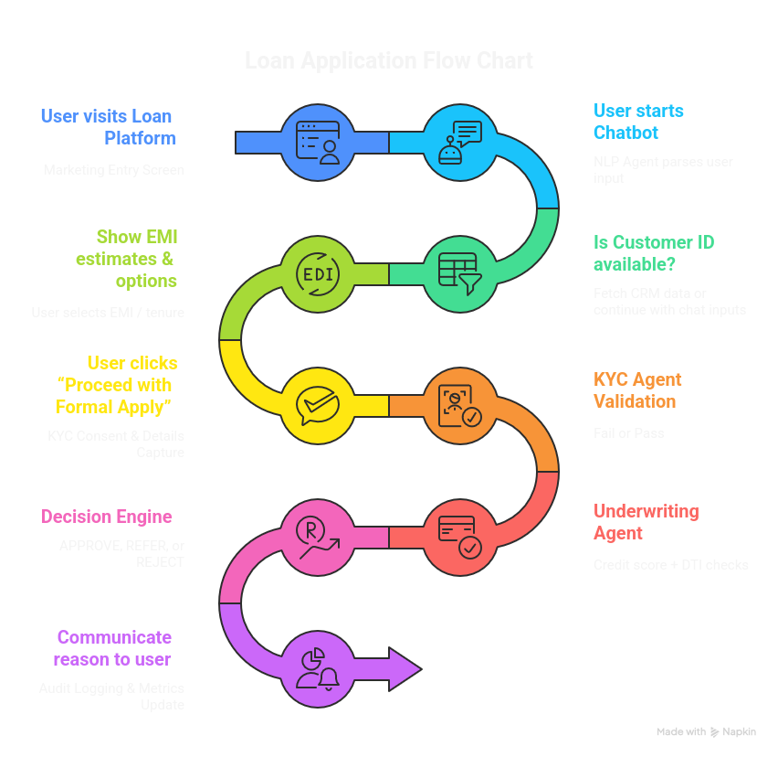

LoanAssist — Agentic AI–Powered Loan Decisioning Platform
=========================================================

LoanAssist is an **AI-driven, end-to-end digital lending assistant** that automates customer interaction, KYC verification, credit underwriting, and sanction letter generation through a conversational interface.The system is designed to be **explainable, auditable, and modular**, making it suitable for BFSI and NBFC use cases.

🚀 Key Features
---------------

*   Conversational loan application via chat UI

*   NLP-based extraction of loan intent, amount, tenure, and income

*   EMI estimation with multiple tenure options

*   CRM integration for customer profile lookup and updates

*   Rule-based KYC verification

*   Explainable underwriting using credit score and DTI logic

*   Automated sanction letter PDF generation

*   Step-by-step loan progress tracker (KYC → Underwriting → PDF)

*   Full audit trail and decision metrics dashboard

🧠 Architecture Overview
------------------------

**Frontend:** Streamlit
**Backend:** FastAPI (REST, stateless)
**Logic:** Agent-based orchestration
**Storage (Demo):** CSV files (CRM, audit logs, metrics)
**Documents:** PDF generation using ReportLab

The architecture follows a **decoupled, API-first design**, allowing independent scaling and easy replacement of demo storage with production databases.

🔄 End-to-End Flow
------------------
`   User Chat   → NLP Parsing   → CRM Fetch / Update   → EMI Estimation   → KYC Consent & Validation   → Underwriting Decision   → Sanction Letter Generation   → Audit & Metrics Logging   `

📊 Audit & Compliance
---------------------

*   Every action is logged to audit\_log.csv

*   Decision metrics are stored in metrics.csv

*   Full traceability of approvals, rejections, and referrals

*   CSV downloads available for compliance review

⚠️ Assumptions & Limitations
----------------------------

*   CSV files are used for demo purposes only

*   Credit score logic is simulated / rule-based

*   No external KYC or credit bureau APIs are integrated

*   Authentication and encryption are omitted for demo simplicity

All components are **designed to be production-replaceable**.

🏁 Conclusion
-------------

LoanAssist demonstrates how **agentic AI systems** can automate and modernize loan workflows while maintaining explainability, auditability, and compliance—critical requirements for BFSI applications.

